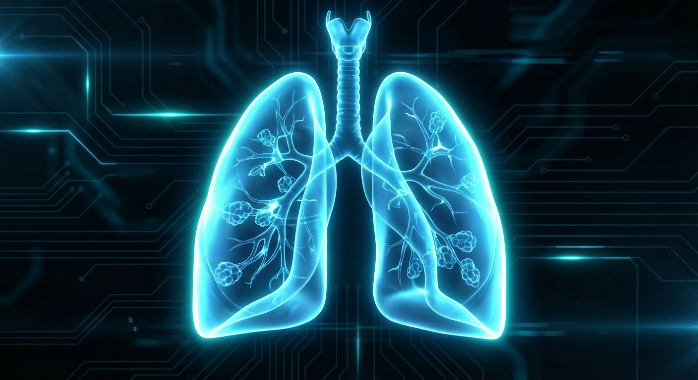
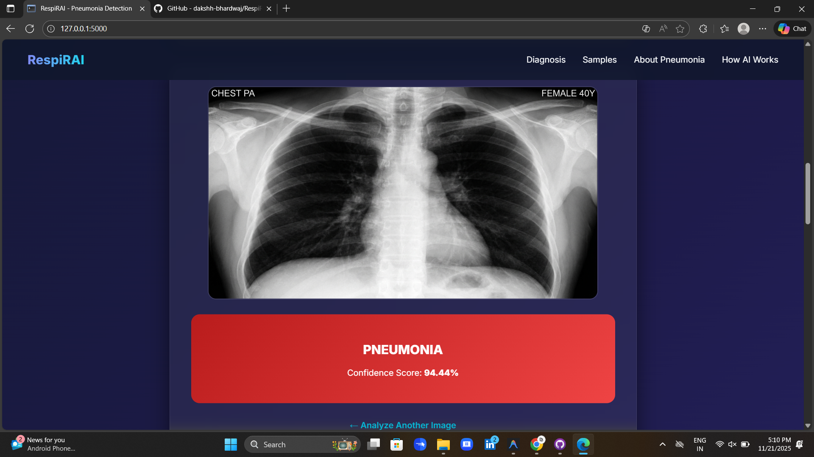
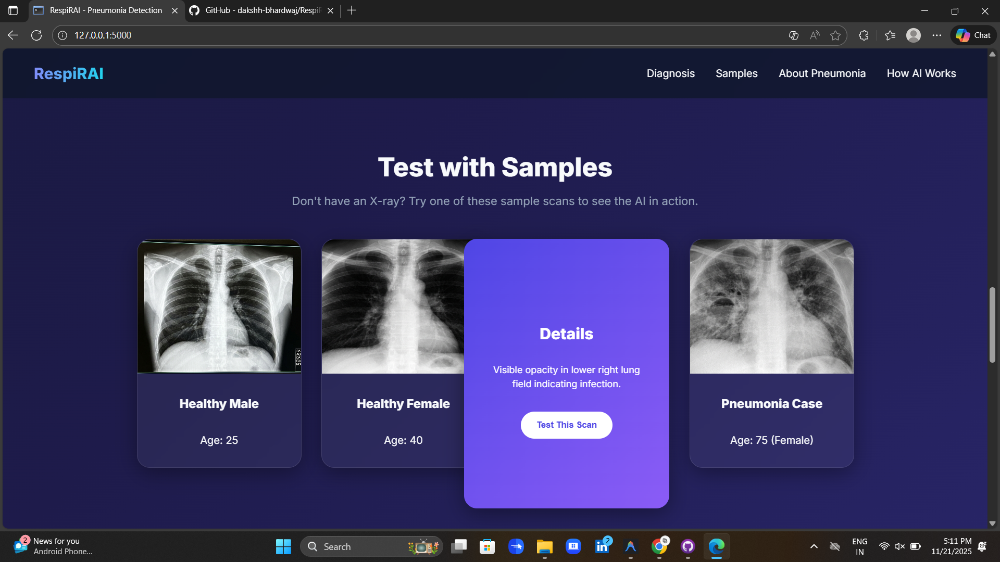
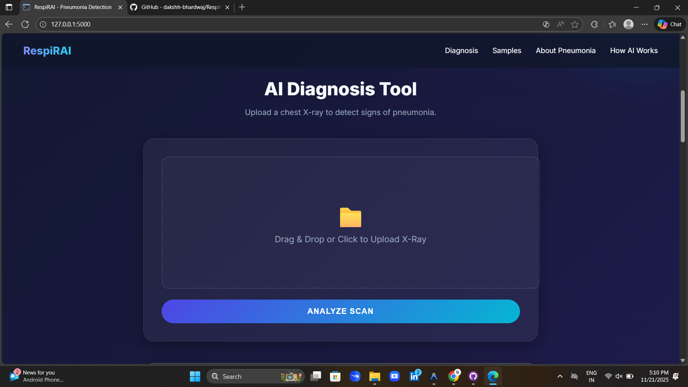
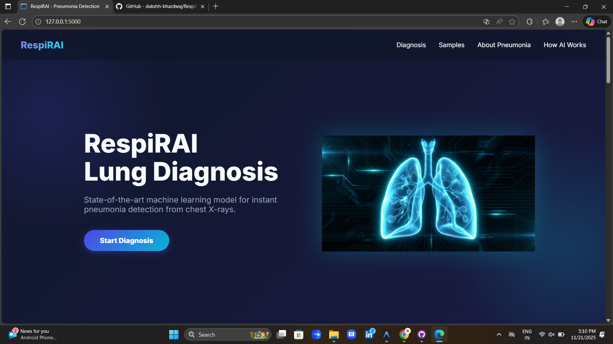

# RespiRAI - Pneumonia Detection System



## 📸 Interface Gallery

| Home Page | Upload Interface |
|:---:|:---:|
|  |  |

| Analysis Result | Sample Scans | AI Explanation |
|:---:|:---:|:---:|
|  |  |  |

**RespiRAI** is a state-of-the-art deep learning application designed to detect pneumonia from chest X-ray images with high accuracy. Built with TensorFlow and Flask, it provides an intuitive web interface for instant diagnosis, helping to bridge the gap between advanced AI diagnostics and clinical application.

## 🚀 Features

*   **High-Accuracy Detection**: Powered by a custom Convolutional Neural Network (CNN) trained on thousands of validated chest X-rays.
*   **Instant Analysis**: Get real-time predictions with confidence scores in seconds.
*   **Interactive Sample Scans**: Includes built-in sample X-rays (Normal & Pneumonia) for immediate testing and demonstration.
*   **Modern UI/UX**: A responsive, glassmorphism-inspired interface with smooth 3D animations and educational content.
*   **Privacy-Focused**: Images are processed locally (or on the server) and not stored permanently.

## 🛠️ Tech Stack

*   **Frontend**: HTML5, CSS3 (Custom Animations), JavaScript
*   **Backend**: Python, Flask
*   **Machine Learning**: TensorFlow, Keras, NumPy
*   **Data Visualization**: Matplotlib, Seaborn (for model evaluation)

## 📦 Installation

1.  **Clone the repository**
    ```bash
    git clone https://github.com/yourusername/RespiRAI.git
    cd RespiRAI
    ```

2.  **Create a virtual environment (Optional but recommended)**
    ```bash
    python -m venv venv
    # Windows
    venv\Scripts\activate
    # macOS/Linux
    source venv/bin/activate
    ```

3.  **Install dependencies**
    ```bash
    pip install -r requirements.txt
    ```

## 🏁 Usage

1.  **Start the application**
    ```bash
    python app.py
    ```

2.  **Access the interface**
    Open your browser and navigate to `http://127.0.0.1:5000`.

3.  **Run a test**
    *   Upload a chest X-ray image (JPEG/PNG).
    *   OR use one of the "Sample Scans" provided on the homepage.
    *   Click **Analyze Scan** to see the result.

## 📊 Model Performance

The model was trained on the [Chest X-Ray Images (Pneumonia)](https://www.kaggle.com/paultimothymooney/chest-xray-pneumonia) dataset.

*   **Accuracy**: >90% (on test set)
*   **Architecture**: Sequential CNN with multiple convolution, pooling, and dense layers.

## 📂 Project Structure

```
RespiRAI/
├── static/             # CSS, Images, Uploads
│   ├── style.css
│   ├── lung_illustration.png
│   └── samples/        # Sample X-ray images
├── templates/          # HTML Templates
│   └── index.html
├── app.py              # Flask Application Entry Point
├── train.py            # Model Training Script
├── evaluate.py         # Model Evaluation Script
├── requirements.txt    # Python Dependencies
└── README.md           # Project Documentation
```

## 🤝 Contributing

Contributions are welcome! Please feel free to submit a Pull Request.

## 📄 License

This project is licensed under the MIT License - see the [LICENSE](LICENSE) file for details.

---
*Disclaimer: This tool is for educational and research purposes only and should not be used as a substitute for professional medical advice, diagnosis, or treatment.*


